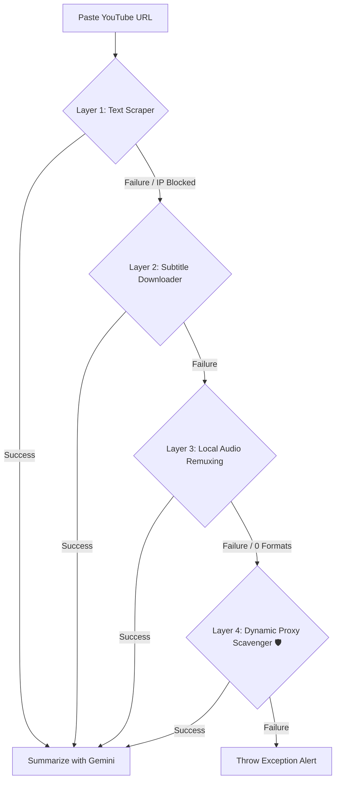

# 🎬 YouTube AI Summarizer

<p align="center">
  
  
  
</p>

**YouTube AI Summarizer** is a premium Python and Streamlit dashboard that instantly transforms long-form YouTube videos into highly detailed, professional blog articles and fully responsive, beautifully styled HTML/CSS webpages.

---

## 🔄 Multi-Stage Fallback Architecture

To guarantee operation even when queried from Cloud Datacenter address subnets (like AWS EC2), the crawler automatically cascades through **four distinct extraction layers**:



### 🧠 The Pipeline:
1. **Custom Authenticated Scraper:** Parses uploaded `cookies.txt` (Netscape format) to bypass standard rate limits without deprecated packages.
2. **Subtitles Downloader:** Standard `yt-dlp` .vtt downloading failsafe if raw text scraping fails.
3. **Local FFmpeg Audio Muxing:** Downloads audio/video fragments on generic fallback profiles, compressing locally to bypass AWS high-definition traffic stream blocks.
4. **Proxy-Scrape Rotating Tunneling:** Dynamically queries free proxy matrices on zero-format manifestations on-the-fly to unlock the stream safely without cost.

---

## ✨ Features

- 🚀 **One-Click Generation:** Single URL text input fetches content silently in the background console.
- 🎨 **Glassmorphic UX Theme:** Features customized Streamlit containers with Google Outfit typography, clean grid alignments, and automated interactive live previews.
- 🖥 **Live Webpage Sandbox View:** Evaluates AI responses building fully operational aesthetic HTML and CSS direct view grids editable directly in tabs.
- 📦 **Static exports:** Download the zipped HTML/CSS workspace folders for instant host deployments.
- 🛡 **IP-Shielding & Self-Correction:** Automatically executes diagnostic dependency sweeps and forces up-to-date `.n-challenge` signature updates.

---

> [!IMPORTANT]
> ### 🛠 Prerequisites (AWS / Linux Containers)
> For this tool to successfully bypass YouTube's datacenter media security, the following binaries must reside in your Host `$PATH`:
> 1. **FFmpeg:** Required for local stream remuxing/fallback files.
> 2. **Node.js:** Required for `yt-dlp` solving YouTube’s automated `.n-challenge` script signatures dynamically.
> 
> **Quick Setup Fix:**
> ```bash
> sudo apt update && sudo apt install -y nodejs npm ffmpeg
> ```

---

## ⚙️ Installation & Usage

### 1. Clone & Core Setup
```bash
git clone https://github.com/Praneesh-Gattadi/YOUTUBE-AI-SUMMARIZER.git
cd YOUTUBE-AI-SUMMARIZER

# Create and Activate Venv (Recommended)
python3 -m venv venv
source venv/bin/activate

pip install -r requirements.txt
```

### 2. Configure Credentials
Acquire a Free key from [Google AI Studio](https://aistudio.google.com/).

- **Option A:** Add to `.env` in the root folder: `GOOGLE_API_KEY=your_key_here`
- **Option B:** Paste directly into secure sidebar configuration input grids on the Live Dashboard.

### 3. Running dashboards
```bash
streamlit run app.py
```

---

<details>
<summary><b>🛡️ Working Around Cloud IP Bans (Cookies Support)</b></summary>
<br>

If you are running this app on AWS and YouTube locks down text scraping, enable Sidebar Cookie Support:
1. Use an extension like *Get cookies.txt* to download your Youtube cookies text files.
2. Upload the file to your Dashboard Sidebar setting.
3. The custom middleware dynamically strips and forwards authenticated requests seamlessly alongside desktop spoofing parameters.
</details>

## 🔒 Copyright & Proprietary

**All Rights Reserved.**  
This software incorporates proprietary algorithms belonging to the creator. No part of this repository may be reproduced, distributed, or transmitted in any form or by any means, including photocopying, recording, or other electronic or mechanical methods, without prior written permission.

---

